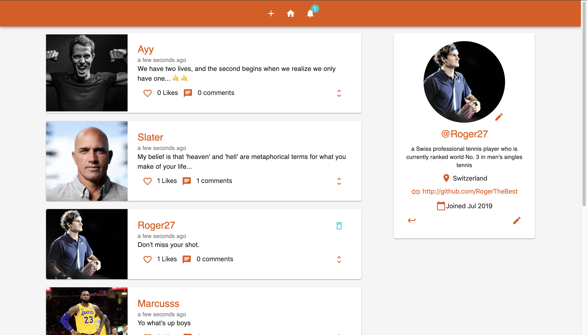
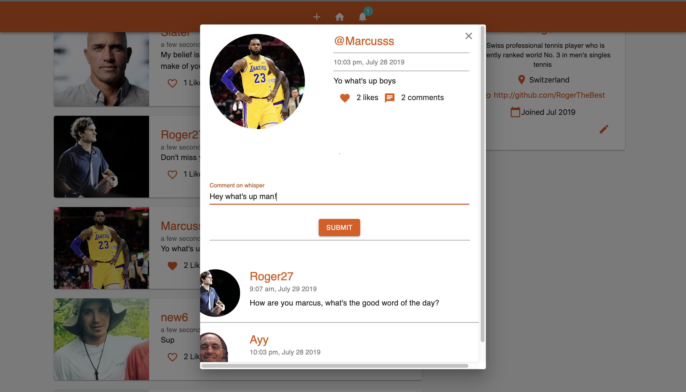
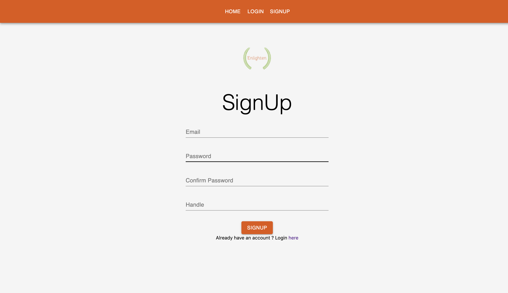

# Enlighten-Social-App

Enlighten is a full fledged social media app where users can make a profile, create and view posts(whispers), and comment on each others posts.

# Developed By

- Cliff Mirschel (BlueBoi904)
- John Mirschel (Munchlaxx)

# Technologies Used

- ReactJS
- Redux
- NodeJS
- Firebase/Firestore
- Material-UI

# What We've Learned

- Developed RESTful API in NodeJS
- Managed and stored data using a NoSQL Database.
- Improved User Validation and Security by developing our own middleware and password encryption.
- Increased backend functionality implementing database triggers.

# Images

